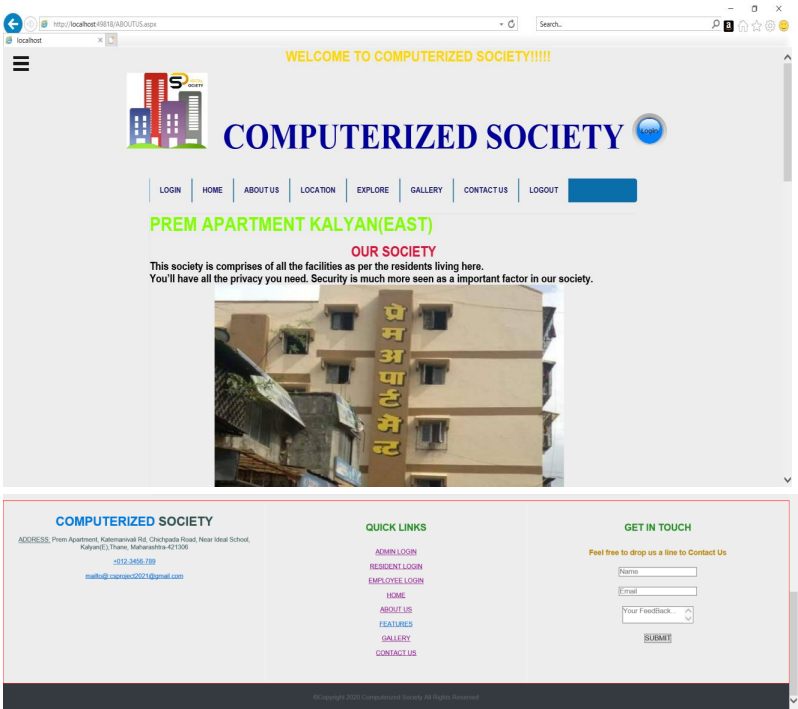
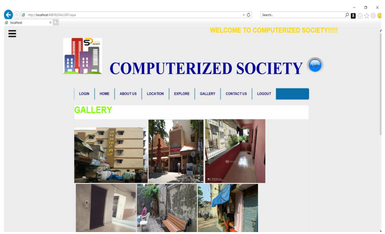
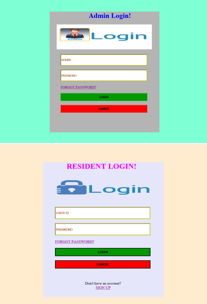
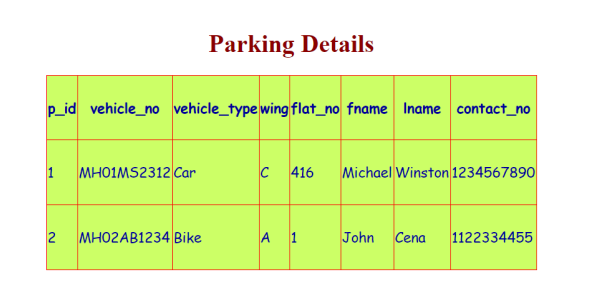
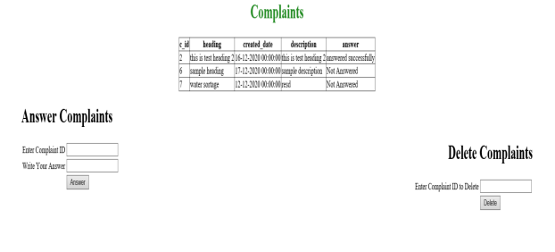
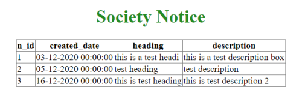
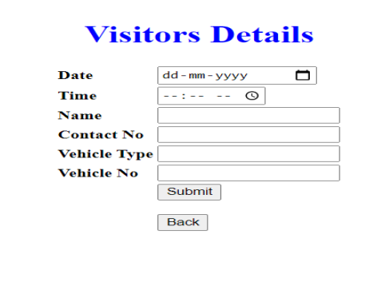
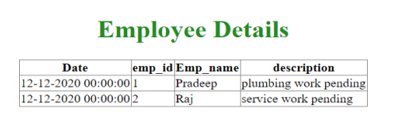

# COMPUTERIZED SOCIETY

Computerized Society is a web-based application. Computerized Society tried to computerize several things that occur within the society and provides a user-friendly interface to all people who are residing in the society and also the Employees, Secretary who are working under a society. 
The main objective of these website is to minimize the 
manual work and to save papers. As the housing society 
management has to keep track of all details regarding whole 
building like resident information, PAYMENT of maintenance 
bills ,etc. . So to manage these all data manually it becomes 
difficult and tedious job to human. And at some point of time it 
leads to confusion also. So as to make the work of the society 
easier & faster as possible ,the website is required to handle it.

## Technologies used in the project

<h2>Front-end:</h2>
- HTML, JavaScript, CSS, ASP.NET

<h2>Back-end:</h2>
- MySQL

## MODEL:
* Agile model.

## Problem Limitations:
1. The resident with no smart gadgets may not take part in the concept of COMPUTERIZED SOCIETY.
2. Traditionally, in society maintenance all information about the residents is stored in papers so there can be a chance 
of data redundancy and data loss.
3. The one who are new to the concept of digital era finds it bit difficult to getting used to it.
    
## Future Scope

* Future system introduces a module name visitors’ site, so that the visitors is been noticed and no fraud could take place.
* Complaints or any queries can be easily marked to the  society authorities using the software.
